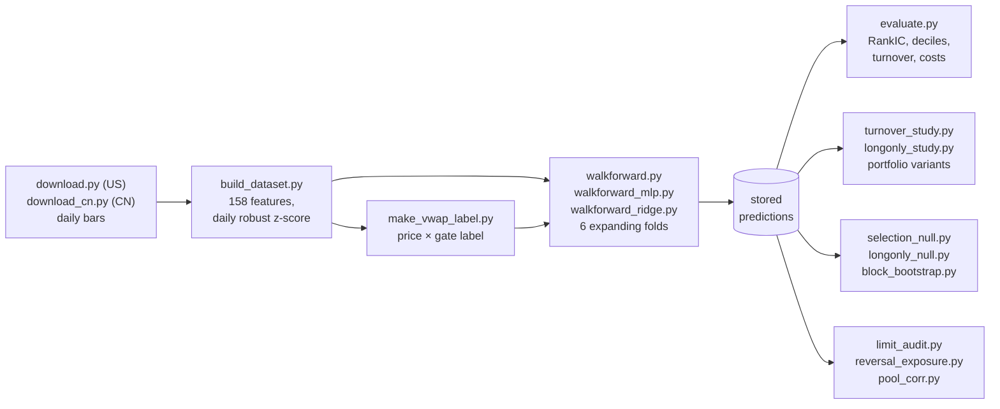

# quant-alpha-research

**A daily cross-sectional stock-ranking pipeline for China A-shares, built end to end from free public
data, with a US large-cap universe as a negative control. The project is mainly about measurement:
how to tell a real, tradable signal from an artifact of the label, the search, or the evaluation.**

Every result below is followed by its row ID in [`docs/results_provenance.md`](docs/results_provenance.md),
which gives the result file or the exact command that produces it. Terms follow
[`docs/glossary.md`](docs/glossary.md).

## Three contributions

1. **The largest gain came from fixing the label, not from a model.** Changing only the price in the
   China A-share (CN) label, from the close to the day's VWAP, raised GBDT RankIC by +57% (L8). The
   unsmoothed long-short portfolio went from net@10 +0.15 to +12.72 bps/day (L12, L13). I had predicted a
   drop. I also found that the original price-limit gate deleted losses that had already happened, and
   replaced it with an entry-only gate. [Deep dive](docs/analysis/2026-09-13-label-vwap-entry.md).
2. **I test the procedure that picked the headline, not only the headline.** The portfolio variants
   were chosen from a grid. Nested reselection shows that the choice added +0.64 bps, about 3% of the
   long-short result (T2). A permutation null that re-runs the whole grid search on shuffled returns
   has a 95th percentile of +0.06 bps, against +23.19 observed (T6).
   [Deep dive](docs/analysis/2026-09-13-selection-procedure-test.md).
3. **The negative control can veto a claim, and it did.** The same pipeline runs on US stocks. A
   within-day permutation test that I had reported as significance passes there too (z = +11.9 on CN,
   +9.2 on US; T8, T9), so I withdrew it. The US data also exposed one spliced price series that had
   distorted every uncapped US bps figure (N10). [Research log R31](docs/research_log.md#r31).

## Results, with their assumptions

CN: GBDT on the `vwap × entry` label. US: the same pipeline on the `hlc3` proxy label. Test years
2020–2025, each predicted once by a model trained only on earlier years (D4). Point values are seed 0.

| Portfolio | Assumes | net@10, bps/day | IR@10 | Seed spread | 95% block-bootstrap interval, net@10 |
|---|---|---|---|---|---|
| CN long-short `ema5/exit10` | Individual A-shares can be shorted (hard in practice) | **+23.19** (P1) | +3.50 (P1) | 3 seeds: mean +22.59, sd 1.57 (P2) | [+16.97, +29.49] (P9) |
| CN long-only `ema5/exit30`, active vs the equal-weight universe | No shorting, no leverage | **+3.11** (P3) | +1.19 (P3) | 3 seeds: mean +3.09, sd 0.53 (P4) | [+0.78, +5.50] (P9) |
| US control, long-short `ema5/exit10` | Shorting possible; `hlc3` proxy price | −2.39 (N5) | −0.32 (N5) | 1 seed | [−8.05, +4.08] (N9) |
| US control, long-only `ema5/exit30` | No shorting; `hlc3` proxy price | +1.67 (N8) | +0.43 (N8) | 1 seed | [−1.40, +5.13] (N9) |

Signal strength: CN RankIC +0.0400 ± 0.0015 over 3 seeds (M1), bootstrap interval [+0.0334, +0.0486]
(P9). US RankIC +0.0071 (N2), interval [+0.0007, +0.0134] (N9). **The US control shows weak but non-zero
ranking; its portfolio is indistinguishable from zero.**

What the table assumes:

- **Returns.** Next-day return: enter on T+1, exit on T+2 (one trading day of holding, starting the day
  after the features are known), filled at the day's VWAP on CN. US has no traded-amount field, so its label uses the typical price `(high + low + close) / 3`,
  which is a proxy and not an executable price. Reported in bps per day.
- **Costs.** 10 bps per unit of turnover (turnover 43.2% long-short, 10.2% long-only; P1, P3). No
  market impact, no borrow fee.
- **IR@10** is a naive annualized ratio. It treats days as independent, but smoothed holdings and
  persistent regimes can make daily returns autocorrelated, so it is a rough guide only.
- **Variant choice.** Both variants were chosen on this period. Nested reselection on 2021–2025 shows
  the choice added +0.64 bps to long-short (T2). On the long-only grid `ema10/exit30` has slightly
  higher net@10 (+3.15) than `ema5/exit30`, which is best by IR@10 (P5).
- **Short leg.** The long-short numbers do not gate short entries at price limits. In an audit on the
  `vwap × full` label, gating them cut the decile spread from +23.63 to +20.19 (A3). The short leg carries
  79% of that spread (L16).
- **Intervals** are circular block bootstraps over test days (block length 20, 2,000 resamples, P9, N9).
  They measure sample-period uncertainty, not training randomness.
- **Universes** are survivor-biased on both markets (D2 and [Limitations](#limitations)).

## Pipeline

## Quick links

- [Research log](docs/research_log.md): one entry per working session, R01–R49; start with the ★ entries.
- Deep dives: [label](docs/analysis/2026-09-13-label-vwap-entry.md) ·
  [selection procedure](docs/analysis/2026-09-13-selection-procedure-test.md) ·
  [block bootstrap](docs/analysis/2026-09-13-block-bootstrap.md) ·
  [reversal exposure](docs/analysis/2026-09-13-reversal-exposure.md) ·
  [common row set](docs/analysis/2026-09-13-common-row-set.md)
- [Results provenance](docs/results_provenance.md): every number, with its source.
- [Glossary](docs/glossary.md) · [Reproduction guide](docs/REPRODUCE.md) · [License](LICENSE)

---

## Findings

Each finding changed one of my own earlier claims. Section X of the provenance sheet lists the values I
corrected; below, each one appears only next to its correction.

### 1. The label: close → VWAP, and a gate that deleted losses

With the gate fixed, switching the CN label's price from the close to VWAP raised RankIC from +0.0236 (L4)
to +0.0369 (L6), +57% (L8). I expected a drop, because closing prices carry bid-ask bounce that looks like
reversal. The label starts on T+1, so bounce cannot line up with day-T features. It can only add noise to
the label, and noise lowers a correlation. The close label also inflated the universe mean return by 3.54
bps per day, about 890 bps per year (L17). I first put it at 500 from a cross-gate comparison (X8), then at
450 by annualizing a daily figure as if it covered two days (X19).

The original gate kept a row only if the stock could be bought on T+1 **and** sold on T+2. A stock that
cannot be sold on T+2 is already held, so its loss is real; dropping those rows cut only the left tail.
The entry-only gate raised RankIC from +0.0369 to +0.0409 (L6, L7) for seed 0; over 3 seeds it is
+0.0400 ± 0.0015 (M1). My earlier conclusion that "a 10 bps cost wipes out the CN signal" (X5, net@10
+0.15) came from the close label; with VWAP the same unsmoothed portfolio earns +12.72 (L13).
See [the label deep dive](docs/analysis/2026-09-13-label-vwap-entry.md), [R27](docs/research_log.md#r27),
[R30](docs/research_log.md#r30).

### 2. Testing the selection procedure

The headline long-short variant was the best of 24. On 2021–2025, the full-sample best earns +22.39,
nested reselection (each year's variant chosen only on earlier years) earns +21.76, so selection added
+0.64 bps (T1, T2). A permutation null that shuffles returns within each day and re-runs the whole grid
search never reached the headline: 95th percentile +0.06 against +23.19 (T6). I had first measured
selection as "best − fixed baseline" (X15). Under the null that gap is larger than observed, +9.40 against
+5.22 (T7), because slower variants save costs even with no signal. The turnover-reduction gain is also
larger on the US control than on CN (T3, T5): it is cost arithmetic, not alpha.
See [the selection deep dive](docs/analysis/2026-09-13-selection-procedure-test.md).

### 3. The negative control vetoed a significance test

The within-day permutation null for the long-only variant gave z = +11.9 on CN (T8). I first read that as
significance (X9). The same test on the US control gives z = +9.2 (T9). A test that passes on the control
cannot separate signal from no signal, so it now supports only the narrow claim that stock selection is
not random. The US control itself is not empty: its RankIC interval excludes 0, while all four portfolio
intervals contain 0 (N9). Its own best long-short variant earns +0.59, IR +0.09 (N6); my earlier "US
long-short is never positive" (X10) was CN's variant applied to US.

### 4. One spliced price series in the US data

A bankruptcy relisting was spliced into one ticker's price history: close $0.12 → $31.00 with the
adjustment factor unchanged, a `label_raw` of +257.3 (N10). RankIC is rank-based and was
unaffected; the bps numbers were not. My earlier US result of a negative spread, −12.40 with
monotonicity +0.067 (X6), came from that row. On the current `hlc3` label, with the evaluation cap
`|label_raw| ≤ 0.8` (20 rows, D7), the US decile spread is +3.13 with monotonicity +0.491 (N3). Without the cap it is +15.89; at caps 0.5
and 0.2 it is +3.42 and +4.03 (N4). See [R31](docs/research_log.md#r31), [R32](docs/research_log.md#r32).

### 5. Selection score vs measurement

My first models seemed stuck near a validation RankIC of 0.01 (X1). Those were tier A selection scores,
the best point of each validation curve. Measured on walk-forward test years, US GBDT gives +0.0033 (N1)
and CN, with the same features, +0.0236 with all six folds positive (L4). "The features are too weak"
held only for US (X3). Every number since then carries a metric tier. See [R18](docs/research_log.md#r18).

### 6. The model vs a one-line reversal factor

Through the same evaluation, the single factor ROC5 earns RankIC +0.0268 and net@10 +11.57 (A1). The
model's decile spread is only 1.42x ROC5's (A2); on the close label the ratio had looked like 2.8x (X11).
The model's score is clearly exposed to short-term reversal: mean daily R² 0.159, β > 0 on 98.6% of days
(A4). Removing that component with an out-of-sample β costs 3.18 bps, 14.3% of long-short net@10, and what
remains (+19.03) is well above reversal alone (+13.11) (A5, on 2021–2025, since the first test year has
no earlier year to estimate β). Correlated with reversal is not the same as reducible to it. See [the reversal deep dive](docs/analysis/2026-09-13-reversal-exposure.md).

### 7. Two kinds of error bar, and a retracted model comparison

The MLP beats GBDT on RankIC, +0.0466 ± 0.0014 vs +0.0400 ± 0.0015 (M1, M2), in 6 of 6 folds (sign test
p = 0.031, M3), but it also wins on the US control (M6), so this is not CN-specific alpha. On long-short
net@10 GBDT leads. I had written that the lead was "more than ten seed sds" (X14), using only the MLP's
seed sd. With both models' seed spreads the gap is 2.15σ (T11), and a paired block bootstrap interval for
MLP − GBDT, [−7.87, +0.51], contains 0 (T10). The same 3-seed sd measured twice gave 0.00143 and 0.00031
(M9), so I now report the pooled within-fold sd (X16 → M10, M11).
See [the bootstrap deep dive](docs/analysis/2026-09-13-block-bootstrap.md).

### 8. The common-row-set trap

To compare eleven models on the same rows, I intersected their row sets. The intersection dropped 5,744
of the headline model's 1,814,693 rows, 0.32%, with a mean absolute return 5.1x the overall mean (E6).
On those common rows the headline net@10 was +17.30 (X17); on its own rows it is +23.19, a 5.9 bps
difference (E7). The dropped rows were the limit-down exit failures that the old gate removes.
See [the common-row-set deep dive](docs/analysis/2026-09-13-common-row-set.md).

---

## Method

**Data.** Daily bars for 2018–2025 (D3). US bars come from Yahoo Finance through `yfinance`
(`dataset/rawdata/download.py`), for the ticker list in `dataset/rawdata/universe_full.txt`, a snapshot of
index members at the end of the sample. CN bars come from free public sources selectable with `--source`
(`dataset/rawdata_cn/download_cn.py`), for the union of historical CSI 300 and CSI 500 constituents
sampled quarterly. Download outcomes are in the manifests: 1,298 of 1,335 US tickers (D1) and 1,313 of
1,377 CN tickers (D2).

**Features.** 158 Alpha158-style price/volume features that I implemented myself
(`dataset/alphaFactor/features.py`), computed within each stock from backward-looking windows. They never
use traded amount; the only VWAP-like feature uses the typical-price proxy. Each trading day, each feature
becomes a cross-sectional robust z-score `(x − median) / (1.4826·MAD)`, clipped at ±3, with missing
values set to 0 (`dataset/alphaFactor/build_dataset.py`).

**Label.** `label_raw = P(T+2) / P(T+1) − 1`, with features known at the close of day T. The model target
`label` is the same daily robust z-score of `label_raw`, clipped at ±3; RankIC uses `label`, and every bps
figure uses `label_raw`. `dataset/alphaFactor/make_vwap_label.py` builds the `price × gate` variants:

- CN default `vwap × entry`: `P` = `amount / volume` scaled by the same-day adjustment factor; a row is kept
  only if the stock can be bought on T+1; rows with `|label_raw| > 0.8` are dropped.
- US `hlc3 × none`: typical price, no gate (no daily price limits). The evaluation tools drop
  `|label_raw| > 0.8` for US bps metrics (`apply_cap` in `model/evaluate.py`, default 0.8 for US, none for CN).
- `--verify` checks that the builder reproduces the dataset's built-in close label exactly.

**Walk-forward.** `model/walkforward.py` trains one LightGBM model per test year from 2020 to 2025 on all
earlier years (at least two). The last 120 trading days of the training window are the validation
segment, used only for early stopping on daily RankIC. A 2-day embargo, equal to the label horizon,
separates training from the test year and the fit segment from the validation segment (D4). The test year
is predicted once and plays no part in any choice. `model/walkforward_mlp.py` uses the same folds with a
Soft IC loss (one minus the daily Pearson correlation), one trading day per batch (I6).
`model/walkforward_ridge.py` fits closed-form ridge and picks alpha on validation RankIC. By default each
run appends a record to its `model/walkforward*.jsonl` file and saves its test-year predictions.

**Evaluation.** Everything after training reads the stored predictions and shares code with
`model/evaluate.py`:

- `model/evaluate.py`: daily RankIC and ICIR, decile returns and monotonicity, the plain long-short
  portfolio, and single-factor baselines (`--baselines`). Before any of that, it recomputes each test
  year's RankIC and checks it against the latest `model/walkforward.jsonl` record for the same market and
  label file (`--label-file`), skipping the check when no record matches.
- Portfolios, in their plain form: equal-weight top decile (long-only, measured against the equal-weight
  universe mean) or top minus bottom decile (long-short), rebalanced daily. Turnover per leg is
  `Σ|w_t − w_{t−1}| / 2`, and `net_t = gross_t − turnover_t × c / 10⁴`.
- `model/turnover_study.py` and `model/longonly_study.py`: `emaS/exitQ` variants, which smooth each
  stock's score with an EMA and hold a stock until it leaves a wider exit band (24 long-short variants,
  12 long-only).
- `model/selection_null.py` (nested reselection, selection permutation null), `model/longonly_null.py`
  (within-day null for one variant), `model/block_bootstrap.py` (circular block bootstrap, `--paired` for
  model differences).
- Audits: `model/limit_audit.py` (short-leg price limits), `model/reversal_exposure.py` (daily regression
  on ROC5 with an expanding-window β), `model/pool_corr.py` (pairwise rank correlation on common rows,
  strength on each member's own rows).

**Look-ahead control.** A walk-forward record trained and tested on a permuted `vwap × full` label gives
RankIC −0.0012 with 2 of 6 folds positive (L10). The permuted label file was made outside the shipped
scripts, so I cite this only as a record in `model/walkforward.jsonl`.

## Repository layout

| Path | Contents |
|---|---|
| `dataset/rawdata/download.py` | US downloader; `universe_full.txt` ticker list; `manifest.csv` download record |
| `dataset/rawdata_cn/download_cn.py` | CN universe builder and downloader; `universe_full_cn.txt`; `manifest_cn.csv` |
| `dataset/alphaFactor/features.py` | Alpha158-style features |
| `dataset/alphaFactor/build_dataset.py` | Feature panel, built-in labels, CN tradability flags, preprocessing |
| `dataset/alphaFactor/make_vwap_label.py` | `price × gate` label variants, `--verify` |
| `model/walkforward.py`, `model/walkforward_mlp.py`, `model/walkforward_ridge.py` | Walk-forward GBDT, MLP, ridge |
| `model/walkforward.jsonl`, `model/walkforward_mlp.jsonl`, `model/walkforward_ridge.jsonl` | Walk-forward result records (tier C) |
| `model/evaluate.py` | The shared evaluation: RankIC, deciles, portfolio, costs, US cap, baselines |
| `model/turnover_study.py`, `model/longonly_study.py` | Long-short and long-only variant grids |
| `model/selection_null.py`, `model/longonly_null.py`, `model/block_bootstrap.py` | Selection tests, permutation null, bootstrap intervals |
| `model/limit_audit.py`, `model/reversal_exposure.py` | Short-leg price-limit audit, reversal-exposure audit |
| `model/pool_corr.py`, `model/pool_corr_results.json` | Model pool correlations and strength |
| `model/epoch_rule.py`, `model/epoch_rule_results.json` | MLP epoch-selection rules |
| `model/train_lgbm.py`, `model/train_mlp.py`, `model/horizon_sweep.py`, `model/experiments.jsonl`, `model/horizon_sweep.jsonl` | Early single-split experiments, whose logs hold tier A/B scores only; the two training scripts also supply shared helpers to the walk-forward scripts |
| `model/compare_lgbm_cn_us.py`, `model/tune_gbdt.py`, `model/meta_mlp.py` | Earlier CN/US comparison, GBDT hyperparameter scan, meta-model experiment |
| `docs/` | Research log, deep dives, provenance sheet, glossary, reproduction guide |

The repository has no market data, built datasets, labels, predictions, or checkpoints. To rebuild
them, follow [`docs/REPRODUCE.md`](docs/REPRODUCE.md). Set `OMP_NUM_THREADS=6` for runs you want to
compare with a stored result.

## Limitations

- **Shorting.** Borrowing individual A-shares is hard, so the long-short row measures signal quality,
  not a strategy I could run. The long-only row is the implementable view, and it is much smaller (P3).
  Short entries are not gated at price limits in the long-short numbers (A3).
- **Execution.** Fills at the day's VWAP, a flat cost per unit of turnover, no market impact, no borrow
  fee. On US the `hlc3` price cannot be traded at all.
- **Survivorship bias.** The US list is an end-of-sample snapshot. On CN, 64 of 1,377 tickers failed to
  download, and they behave like delisted names (D2). The bias flatters results, especially long-tilted
  ones, which is one reason I do not claim the small positive US long-only number as alpha.
- **Choices made before the grid.** Nested reselection and the permutation null cover the portfolio
  variant only. The label definition, features, and model parameters were also chosen while looking at
  results from this period, and no test here reaches those choices.
- **One sample period, few seeds.** Six test years; three seeds for CN, one for US. A 3-seed sd has 2
  degrees of freedom (P2), and two measurements of the same one differed by 4.6x (M9).
- **The two markets are not comparable.** Labels, gates, and universes differ, so I give no cross-market
  ratio. US is a control, not a second result.
- **The US cap is a judgment call.** On CN, daily price limits make a T+1 → T+2 `|label_raw|` above 0.8
  implausible; on US such moves can happen. At caps 0.8, 0.5, and 0.2 the US decile spread stays
  between +3.13 and +4.03, against +15.89 uncapped, and RankIC barely moves (N4).
- **Transcribed portfolio numbers.** Decile, portfolio, null, and bootstrap tools print to the terminal.
  The provenance sheet transcribes their output; a machine-readable archive is planned.
- **No automated tests** beyond the scripts' built-in self-checks (`--verify`, the `evaluate.py` RankIC check).

## Next

1. **Loss diversity.** MLP members that differ only in their loss, with architecture, folds, and label
   unchanged ([R43](docs/research_log.md#r43), [R46](docs/research_log.md#r46)).
2. **Nested ensembles.** Equal weight, then linear stackers, then greedy ensemble selection. I promote an
   ensemble only if it beats the best single member on net@10, its paired-bootstrap interval for the
   difference excludes 0, it passes the common-row audit, it does not rest on one seed or one year, and the
   US control shows no gain of the same shape.
3. **Engineering.** One experiment config, a machine-readable result registry, and regression tests.
4. **Architectures last**, and only if they add diversity to the pool.

## License

The code is released under the [MIT License](LICENSE). The license covers code, not data: market data
downloaded with these scripts is subject to its providers' terms and is not included in this repository.
